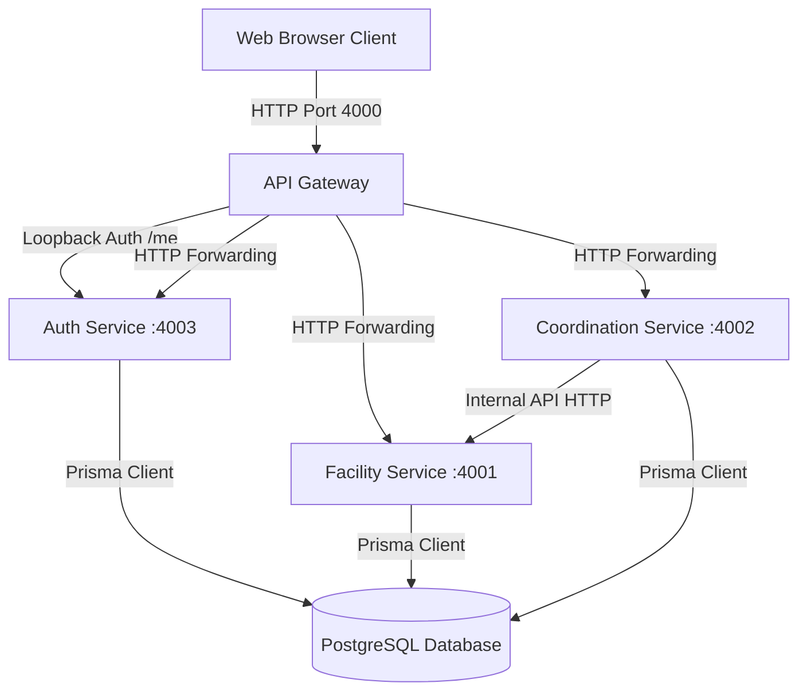
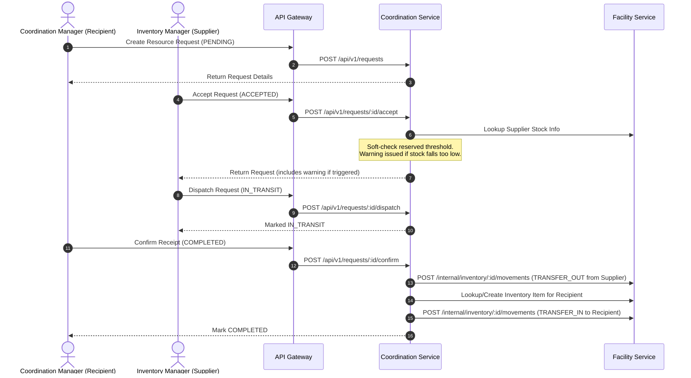

# Medgrid Codebase Analysis Report

This report provides a thorough analysis of the Medgrid repository, including its architecture, domain model, communication patterns, core business workflows, and technical stack. The analysis ignores the `new/` directory as requested.

---

## 1. High-Level Architecture

Medgrid is organized as a **monorepo** utilizing **pnpm workspaces** and **Turborepo** for build pipelines and project orchestration. 

### Key Workspaces
The monorepo defines the following applications under [apps](file:///d:/medgrid/apps) and packages under [packages](file:///d:/medgrid/packages):

*   **Applications (`apps/`)**:
    *   [gateway](file:///d:/medgrid/apps/gateway): The public API entrypoint. Performs request validation, routing, and authentication loops before forwarding request contexts to downstream microservices.
    *   [auth-service](file:///d:/medgrid/apps/auth-service): Handles user session validation (login, refresh, logout), password management, and invitation mechanics.
    *   [facility-service](file:///d:/medgrid/apps/facility-service): Manages facilities, onboarding requests, inventory stock levels, thresholds, and alerts.
    *   [coordination-service](file:///d:/medgrid/apps/coordination-service): Orchestrates resource transfers, requests between facilities, and lifecycle state management.
    *   [frontend](file:///d:/medgrid/apps/frontend): React SPA client dashboard.
*   **Shared Packages (`packages/`)**:
    *   [database](file:///d:/medgrid/packages/database): Houses the Prisma schema, client, migrations, seeding code, and audit-logging utility.
    *   [shared](file:///d:/medgrid/packages/shared): Houses TypeScript types, schemas, validation logic, errors, and Data Transfer Objects (DTOs) shared between the backend services and frontend.
    *   [config](file:///d:/medgrid/packages/config), [eslint-config](file:///d:/medgrid/packages/eslint-config), [tsconfig](file:///d:/medgrid/packages/tsconfig): Shared config presets.

---

## 2. Database Domain Model

The database is built on PostgreSQL, schema managed via Prisma. The schema definitions reside in [schema.prisma](file:///d:/medgrid/packages/database/prisma/schema.prisma).

### Core Entities

| Model | Purpose | Key Relations / Fields |
| :--- | :--- | :--- |
| **`User`** | System actors who access the platform. | Roles: `SUPER_ADMIN`, `FACILITY_ADMIN`, `COORDINATION_MANAGER`, `INVENTORY_MANAGER`. Relates to `Facility` (nullable for Super Admin). |
| **`Facility`** | Operating healthcare centers, pharmacies, blood banks, or suppliers. | Has contact details, geo-coordinates, and relationships to `User`, `Inventory`, and incoming/outgoing `ResourceRequest`s. |
| **`FacilityOnboardingRequest`**| Public facility registrations awaiting `SUPER_ADMIN` review. | Statuses: `PENDING`, `APPROVED`, `REJECTED`. |
| **`Inventory`** | Trackable items managed by a specific facility. | Categories: `BLOOD`, `PPE`, `MEDICATION`, `MEDICAL_EQUIPMENT`. Stores current status, dynamic metadata, and stock thresholds. |
| **`StockMovement`** | Historical immutable record of stock adjustments. | Signed quantities. Types: `RESTOCK`, `CONSUMPTION`, `ADJUSTMENT`, `EXPIRED_REMOVAL`, `DAMAGE`, `TRANSFER_OUT`, `TRANSFER_IN`. |
| **`LowStockAlert`** | Active alerts triggered when stock drops below thresholds. | Immutable record resolved when stock is replenished. |
| **`ResourceRequest`** | Multi-step request coordination between two facilities. | Statuses: `PENDING`, `ACCEPTED`, `IN_TRANSIT`, `COMPLETED`, `CANCELLED`, `REJECTED`, `FAILED`. Priorities: `LOW` to `CRITICAL`. |
| **`UserInvitation`** | Secure hashed invitation tokens for onboarding managers/admins. | Tied to pending user accounts. |
| **`AuditLog`** | Immutable logs of all administrative and operations changes. | Actor details snapshot, previous vs. new JSON value states, IP & UserAgent. |

---

## 3. Communication Patterns & Service Isolation

### Request Verification Pipeline
The backend microservices communicate over standard HTTP calls. The architecture isolates backend logic from direct external network exposure:

1.  **Ingress**: The client requests route through the [Gateway app](file:///d:/medgrid/apps/gateway/src/app.ts).
2.  **Auth Resolution**: Middlewares such as [requireRole](file:///d:/medgrid/apps/gateway/src/middlewares/require-role.middleware.ts) query the `auth-service` via standard HTTP client [getMeFromAuthService](file:///d:/medgrid/apps/gateway/src/clients/auth/auth.client.ts) to verify authorization headers.
3.  **Forwarding**: If validated, the gateway forwards requests downstream, appending custom headers containing the authenticated context:
    *   `x-facility-id`
    *   `x-user-id`
4.  **Action Execution**: Microservice controllers extract these headers directly (e.g. `req.headers['x-facility-id']`) to resolve scope, avoiding the overhead of repeating token parsing.

### Inter-Service Communication
The `coordination-service` depends on the `facility-service` to inspect inventory levels and generate stock transactions. This is achieved via private routes under the `/internal` namespace in [facility-service's internal.route.ts](file:///d:/medgrid/apps/facility-service/src/routes/internal.route.ts):
*   `GET /internal/inventory/lookup`: Checks stock size and reservation boundaries for a specific item.
*   `POST /internal/inventory/create-for-transfer`: Automatically spins up new inventory records in the requesting facility using template metadata.
*   `POST /internal/inventory/:id/movements`: Books `TRANSFER_OUT`/`TRANSFER_IN` transactions.

---

## 4. Key Workflows

### Resource Request Fulfillment & Stock Adjustment
The central business flow is orchestrating resource requests between facilities. This workflow spans both `coordination-service` and `facility-service`:

---

## 5. Frontend Client Architecture

The frontend dashboard application is designed for modern operational needs:
*   **Tech Stack**: Built with React 19 and Vite 8, utilizing Tailwind CSS v4 and Radix UI components (following the Shadcn UI design patterns).
*   **State Management**: Orchestrated using Zustand stores:
    *   [auth.store.ts](file:///d:/medgrid/apps/frontend/src/stores/auth.store.ts): Persists user metadata locally; handles access token cache and triggers silent re-verification loops on app initialization.
    *   [theme.store.ts](file:///d:/medgrid/apps/frontend/src/stores/theme.store.ts): Controls user interface visual themes.
*   **Client API**: Uses a custom fetch wrapper in [api/client.ts](file:///d:/medgrid/apps/frontend/src/api/client.ts) that injects authentication headers and automatically routes requests to the API Gateway.
*   **Routes Layout**: Managed in [routes/index.tsx](file:///d:/medgrid/apps/frontend/src/routes/index.tsx) with lazy loading (`lazy`/`Suspense`) for optimized bundle sizes. Routes are strictly isolated using `ProtectedRoute` wrappers checking specific `UserRole` policies:
    *   `SUPER_ADMIN`: Accessible routes include `/admin/dashboard`, `/admin/approvals`, `/admin/users`, `/admin/audit`.
    *   `FACILITY_ADMIN`, `COORDINATION_MANAGER`, `INVENTORY_MANAGER`: Operational dashboards, `/requests`, `/inventory`, `/facilities`, and `/settings`.
