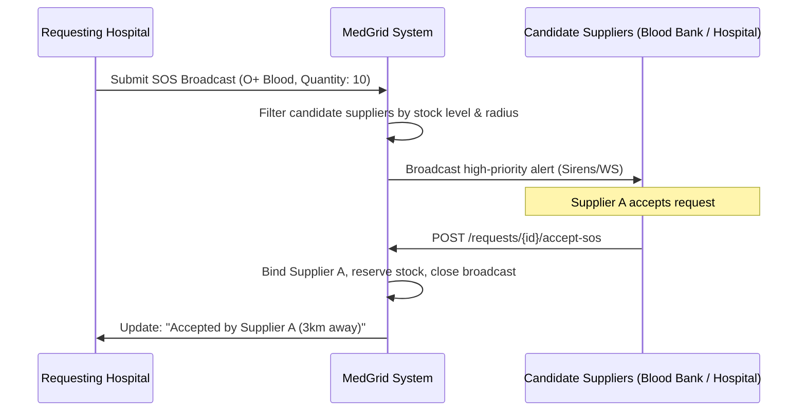

# Brainstorming: Emergency Request & SOS Broadcast Feature

This document outlines the proposed design, database schema updates, backend architecture, and frontend user experiences for the new **Emergency Request (SOS Broadcast)** feature.

---

## 1. Core Concepts & Workflow

Currently, `ResourceRequest` is point-to-point (one facility requests from one selected supplier). An **Emergency Request** changes the paradigm:

### A. Point-to-Point Emergency Request
*   A direct request sent to a specific facility, flagged as `isEmergency`.
*   Bypasses normal approval states: goes directly to the supplier's high-alert dispatch queue.
*   Triggers auditory/visual sirens in the supplier's dashboard.

### B. Broadcast SOS (Emergency Broadcast)
*   A facility in distress broadcasts an open request (e.g. *"We need 10 Units of O+ Blood immediately due to a trauma event"*).
*   Instead of choosing a supplier, the system broadcasts the request to **all nearby candidate suppliers** (determined by geolocation and resource availability).
*   Any candidate supplier with sufficient inventory can click **"Accept SOS"**, which binds them as the supplier, deducts/reserves their stock, and starts the transport workflow.



---

## 2. Technical Implementation Details

### Database Schema Updates (`schema.prisma`)
We can add flags to the `ResourceRequest` model:

```prisma
model ResourceRequest {
  // ... existing fields ...
  
  isEmergency  Boolean  @default(false)
  isBroadcast  Boolean  @default(false)
  
  // Optional broadcast constraints
  maxRadiusKm  Int?     @default(50)
  
  // Track candidates who have rejected it (so they don't see it again)
  declinedBy   String[] // Array of Facility IDs
}
```

### Backend Matchmaking & Notification Engine (Coordination Service)
1.  **Geolocation Search**:
    *   Using the `latitude` and `longitude` fields in the `Facility` model, compute distances using the Haversine formula directly in PostgreSQL (or a database helper).
2.  **Stock Filtering**:
    *   Only show the broadcast to facilities that have the required `itemName` and `resourceType` in stock (available quantity $\ge$ requested quantity) and are marked `isMovable: true`.
3.  **Active Broadcast Routing**:
    *   When an SOS is created, broadcast a real-time event via WebSocket (`io.to('facility_type_room')` or global room).
4.  **Mutex Lock on Accept**:
    *   Use database transactions to ensure that if multiple facilities click "Accept" at the exact same time, only the first transaction succeeds:
        ```typescript
        const result = await prisma.$transaction(async (tx) => {
          const request = await tx.resourceRequest.findUnique({ where: { id } });
          if (request.supplyingFacilityId) throw new Error("Request already claimed");
          return tx.resourceRequest.update({
            where: { id },
            data: { supplyingFacilityId: myFacilityId, status: 'ACCEPTED', acceptedAt: new Date() }
          });
        });
        ```

---

## 3. Frontend Layout & User Experience

We can build a stunning, premium UI for coordination managers:

### A. The "SOS Dashboard" (Emergency Panel)
*   **Aesthetic**: Sleek dark mode panel with pulsing red glow effects, emergency sirens (visual/sound toggle), and real-time updates.
*   **Components**:
    *   **Pulsing Map**: A leaf-map visualization showing active distress calls and color-coded supplier distances.
    *   **Distress Cards**: Cards listing elapsed time, requested item type, quantity, and distance to the call.

### B. Triggering an SOS (The "Panic Button")
*   A persistent, subtle floating red SOS button in the bottom right corner of the dashboard for Coordination Managers.
*   Clicking it slides out a simplified one-page drawer:
    *   What resource is needed?
    *   Quantity?
    *   Confirm location coordinates.
    *   *Broadcast!*
