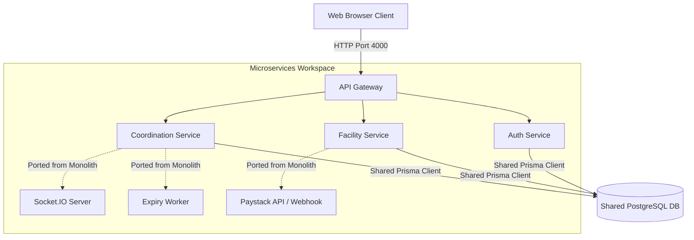

# MedGrid Codebase Comparison & Architecture Evaluation Report

> **Target Workspace**: D:\medgrid (Microservices Monorepo) vs D:\medgrid\new (Monolith)  
> **Date**: 2026-07-03  
> **Prepared by**: Antigravity AI

This report provides a detailed architectural, functional, and security comparison between the two variants of the MedGrid healthcare resource coordination platform: the **Microservices Monorepo** (under `D:\medgrid\apps`) and the **Monolith** (under `D:\medgrid\new`).

---

## 1. Feature Availability Comparison Matrix

| Feature / Capability | Microservices Monorepo (`D:\medgrid`) | Monolith (`D:\medgrid\new`) |
| :--- | :---: | :---: |
| **Real-time Live Sync (Socket.IO)** | ❌ *Not implemented (REST polling/refresh only)* | ✅ **Implemented** (Immediate socket broadcast network-wide) |
| **Financial System (Facility Balance)** | ❌ *Not implemented* | ✅ **Implemented** (Decimal balances, transaction ledger) |
| **Payment Gateway (Paystack)** | ❌ *Not implemented* | ✅ **Implemented** (Auto-credits balance via webhooks) |
| **Automated Request Expiry Worker** | ❌ *Not implemented (Stays PENDING forever)* | ✅ **Implemented** (60-second interval expiry daemon) |
| **Multi-channel Notifications Engine** | ❌ *Stub (Frontend only, no backend)* | ✅ **Implemented** (WebSocket, push, and SMTP emails) |
| **Platform-wide Audit Logging** | ✅ **Implemented** (Unified logger, 30+ actions, detailed diffs) | ❌ *Limited (Inventory audits only, no auth/admin logging)* |
| **Self-service Onboarding Approvals** | ✅ **Implemented** (4-step guest onboarding form, admin reviews) | ❌ *Not implemented (Admin creates facilities manually)* |
| **Secure Invitation Workflows** | ✅ **Implemented** (Token-based complete-profile password resets) | ❌ *Limited (Plaintext credentials printed to admin console)* |
| **State Management & Caching** | ✅ **Implemented** (TanStack Query caching, Zustand stores) | ❌ *Limited (Raw useState/useEffect API polling)* |
| **Request Lifecycle Complexity** | ✅ **Detailed** (7 states: Accept, Reject, Dispatch, Confirm) | ❌ *Simplified* (5 states: Acknowledge & direct Fulfill) |
| **Stock Movement Ledger** | ✅ **Implemented** (Immutable audit movements tracking restock/damage) | ❌ *Limited (Direct count adjustments only)* |

---

## 2. Deep Dive: Exclusive Monolithic Features

The Monolith (`D:\medgrid\new`) represents a functionally richer business model from an operational and billing standpoint. The following features are present in the Monolith but entirely missing in the Microservices version:

### A. Financial Balancing & Billing Logic
*   **Business Flow**: Every coordination request carries a financial value (`pricePerUnit` and `totalAmount`). Fulfilling a request automatically checks if the requesting facility has a sufficient ledger balance. On success, the total amount is deducted from the requester and added to the responder.
*   **Transaction Logs**: Maintains a `BalanceTransaction` model recording all credits/debits, payment methods, and references.
*   **Significance**: Without this, the microservices version functions purely as an altruistic network, which limits commercial deployment capabilities.

### B. Payment Integration (Paystack Gateway)
*   **Implementation**: Employs `PaystackService` in the backend to initialize transactions and trigger credit. Frontend renders a "Top Up" modal that redirects users to Paystack's hosted payment screens.
*   **Webhook Security**: Backend features a `/webhooks/paystack` endpoint validating incoming JSON payloads against Paystack's HMAC SHA512 signature using `x-paystack-signature` headers.

### C. Multi-Channel Notification Engine & Email Templates
*   **Delivery Logic**: Integrates Nodemailer with HTML templates (`emailTemplates.ts`) to deliver emails automatically on events like low balance, top-ups, request creations, and cancellations.
*   **WebSocket Rooms**: Segregates real-time notifications by facility room (`facility:{facilityId}`) and super admin room (`super_admin`).
*   **Preferences**: Allows users to control notification preferences (WebSocket vs Email vs Push, with toggles for "Emergency Only").

### D. Automated Request Expiry Worker
*   **Implementation**: The server mounts a background daemon `expiry.worker.ts` executing every 60 seconds. It fetches open or acknowledged emergency requests that exceed their computed `expiresAt` timeframe, updates their status to `expired` in bulk, and fires notification alerts.

---

## 3. Deep Dive: Exclusive Microservices Strengths

The Monorepo (`D:\medgrid`) utilizes a highly structured codebase designed for standard enterprise scalability. The following systems are implemented far better in the Microservices project:

### A. Platform Security and Secure Invitation Flows
*   **Auth Strategy**: Microservices enforce a **dual-token system** (short-lived access token in memory + long-lived refresh token in an `httpOnly` secure cookie). The Monolith exposes the JWT directly in `localStorage` which exposes users to XSS compromises.
*   **Invite Flow**: The Microservices version generates a cryptographically secure, signed invitation token (`UserInvitation` model) for staff creation. The user receives a link `/invite/complete?token=...` and sets their own password. The Monolith prints plaintext auto-generated passwords directly to the creator's screen, an insecure practice.

### B. System-wide Audit Trails
*   **Implementation**: The monorepo has a comprehensive audit database logging system (`AuditLog`). Every auth change (failed login, lockout), facility adjustment, inventory restock, and request change creates an immutable trail including:
    *   Actor details snapshot
    *   JSON diffs (`previousValue` vs `newValue` payloads)
    *   Metadata (Client IP address, User Agent strings)
*   **UI Dashboard**: Super Admins have access to a sophisticated `/admin/audit` log browser equipped with multiple filters, expandable diff panels, and CSV export. The Monolith only tracks inventory changes (`InventoryAudit`).

### C. Self-Service Onboarding & Admin Gatekeeping
*   **Implementation**: Rather than manual entry, the Microservices version provides a comprehensive public 4-step wizard registration form (`/register`). New facility nodes enter a `PENDING_APPROVAL` buffer queue. Super admins review details, reject with feedback, or approve (which triggers automated Prisma database transactions creating the facility and user record).

### D. SOS Broadcast Filtering and Dismissal
*   **Implementation**: The microservices coordination service implements a `declinedBy` string array on the `ResourceRequest` model. When an SOS broadcast appears, users can click **"Dismiss Signal"**, which appends their facility ID to this array and filters it from their view. In the Monolith, no dismiss mechanism exists, meaning unwanted alerts occupy display real estate until acknowledged or expired.

---

## 4. Technical Stack & State Management Comparison

### Frontend Architectural Evaluation
*   **Data Synchronization**:
    *   **Microservices**: Leverages **TanStack Query** (React Query). Fetch states are managed implicitly. Components declare query hooks that refresh on window focus, invalidate dynamically when mutations complete, and cache results locally.
    *   **Monolith**: Uses manual `fetch` calls housed inside `useEffect` logic. Component reloading relies on triggering local state toggles or re-executing functions, leading to repetitive code and higher API overhead.
*   **Bundle Management**:
    *   **Microservices**: Utilizes lazy-loading (`React.lazy`) and router `<Suspense>` components for granular chunk bundling, decreasing initial page weight.
    *   **Monolith**: Imports page files statically, resulting in a single heavy bundle file.

### Backend Architectural Evaluation
*   **Monorepo separation vs Monolith modularity**:
    *   **Microservices**: Downstream service isolation (Auth vs Facility vs Coordination) is enforced via independent Express builds. Downstream servers sit behind an API Gateway (`apps/gateway`) that handles JWT extraction and proxies request headers safely. 
    *   **Monolith**: Single Express server layout. Features are broken down into logical folders under `/modules`, making deployments easier but increasing system coupling.

---

## 5. Architectural Recommendations

To build the most stable, secure, and feature-rich version of MedGrid, the development team should combine the operational strengths of the Monolith with the architectural standards of the Microservices monorepo.

### Action Items for Porting Monolith Features to Monorepo:
1.  **Migrate Financial Models**: Add the `balance` field to `Facility` and port the `BalanceTransaction` model into `packages/database/prisma/schema.prisma`.
2.  **Add Payment Gateways to Facility Service**: Port `PaystackService` and the `/webhooks/paystack` webhook controller directly into `apps/facility-service`.
3.  **Upgrade Coordination Service to WebSockets**: Mount a Socket.IO namespace on `apps/gateway` or `apps/coordination-service` so point-to-point requests and SOS broadcasts can utilize live event routing.
4.  **Adopt Multi-channel Notifications**: Create an independent notification service package or place a notification listener process inside the monorepo to send Nodemailer emails without blocking operational API request-response loops.
