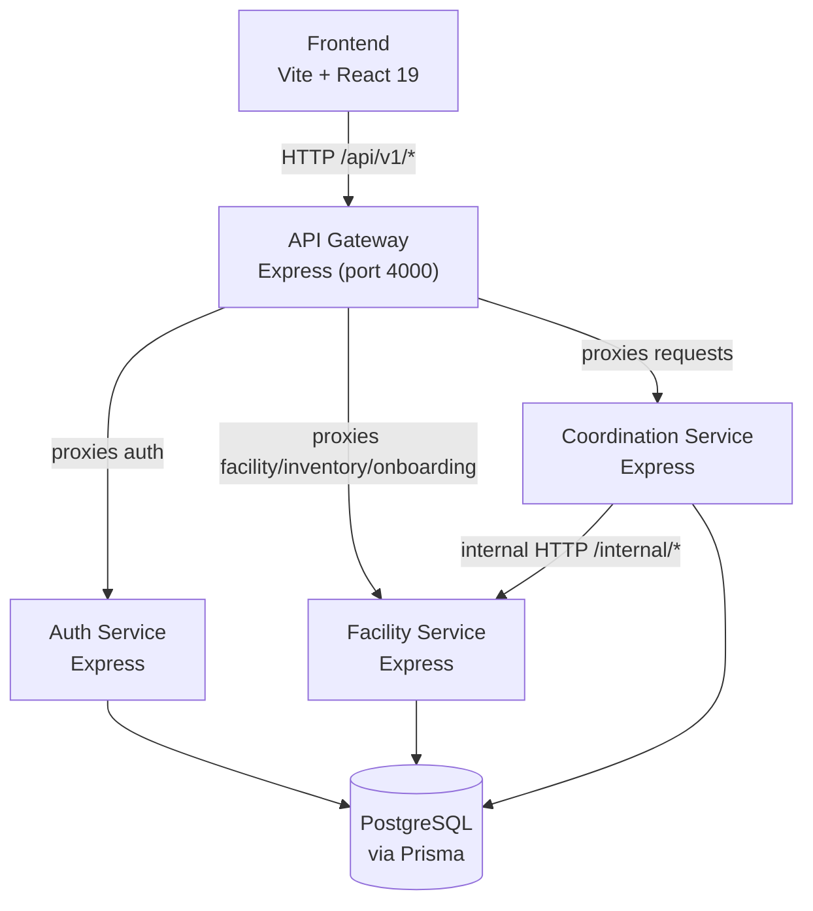

# MedGrid — Codebase Analysis

## Overview

**MedGrid** is a healthcare resource coordination platform — a network that allows healthcare facilities (hospitals, pharmacies, blood banks, PPE suppliers) to discover one another, request scarce resources, and track fulfilment lifecycle. The platform is built as a **TypeScript monorepo** managed by **pnpm workspaces** and orchestrated by **Turborepo**.

---

## Architecture



### Monorepo Layout

| Path                        | Role                                      |
| --------------------------- | ----------------------------------------- |
| `apps/frontend`             | React SPA                                 |
| `apps/gateway`              | Single-entry API gateway (port 4000)      |
| `apps/auth-service`         | Authentication & user management          |
| `apps/facility-service`     | Facilities, inventory, onboarding         |
| `apps/coordination-service` | Resource request lifecycle                |
| `packages/database`         | Shared Prisma schema + client             |
| `packages/shared`           | DTOs, error factories, Zod schemas, enums |
| `packages/config`           | Shared config primitives                  |
| `packages/tsconfig`         | Shared TypeScript configs                 |
| `packages/eslint-config`    | Shared ESLint rules                       |

---

## Tech Stack

### Backend

| Concern         | Technology             |
| --------------- | ---------------------- |
| Runtime         | Node.js                |
| Framework       | Express.js             |
| Language        | TypeScript 6           |
| ORM             | Prisma 7 (PostgreSQL)  |
| Auth            | JWT (access + refresh) |
| Password        | bcrypt (12 rounds)     |
| Build           | Turborepo + `tsx`      |
| Package Manager | pnpm 10                |

### Frontend

| Concern       | Technology                             |
| ------------- | -------------------------------------- |
| Framework     | React 19 (Vite 8)                      |
| Routing       | React Router v7                        |
| State         | Zustand 5 (persist middleware)         |
| Server State  | TanStack Query v5                      |
| Forms         | React Hook Form + Zod v4               |
| UI            | Shadcn/UI (Radix UI) + Tailwind CSS v4 |
| Notifications | Sonner                                 |
| Icons         | Lucide React                           |

---

## Data Model (Prisma Schema)

```mermaid
erDiagram
  User {
    String id PK
    String email UK
    UserRole role
    UserStatus status
    String facilityId FK nullable
    Boolean mustChangePassword
    Int failedLoginAttempts
    DateTime lockedUntil nullable
  }

  Facility {
    String id PK
    String name
    FacilityType type
    FacilityStatus status
    Float latitude
    Float longitude
    String region
    String district
  }

  FacilityOnboardingRequest {
    String id PK
    OnboardingRequestStatus status
    String adminEmail UK
  }

  Inventory {
    String id PK
    String facilityId FK
    ResourceType resourceType
    String itemName
    InventoryUnit unit
    InventoryStatus status
    Int lowStockThreshold nullable
    Int reservedThreshold nullable
    Json metadata
  }

  StockMovement {
    String id PK
    String inventoryId FK
    Int quantity "signed: +in / -out"
    StockMovementType movementType
  }

  LowStockAlert {
    String id PK
    String inventoryId FK
    DateTime resolvedAt nullable
  }

  ResourceRequest {
    String id PK
    String requestingFacilityId FK
    String supplyingFacilityId FK nullable
    RequestStatus status
    RequestPriority priority
    ResourceType resourceType
    Json patient nullable
  }

  UserInvitation {
    String id PK
    String userId FK UK
    String tokenHash
    DateTime expiresAt
  }

  AuditLog {
    String id PK
    String actorId "plain string, no FK"
    AuditAction action
    Json previousValue nullable
    Json newValue nullable
  }

  User }o--|| Facility : "belongs to"
  Inventory }o--|| Facility : "owned by"
  StockMovement }o--|| Inventory : "tracks"
  LowStockAlert }o--|| Inventory : "alerts on"
  ResourceRequest }o--|| Facility : "requesting"
  ResourceRequest }o--o| Facility : "supplying"
  UserInvitation ||--|| User : "for"
```

### Key Design Decisions

- **Stock is derived** (sum of `StockMovement.quantity`) — no mutable quantity column.
- **AuditLog has no FK** on `actorId` — logs survive user deletion.
- **Soft delete** on `User` and `Inventory` (via `deletedAt`).
- **`Inventory.metadata: Json`** stores type-specific fields (blood type, medication details, etc.) with a discriminated `resourceType` pattern.

---

## Service Breakdown

### Auth Service

**Modules:** `auth`, `users`

**Capabilities:**

- `POST /auth/login` — bcrypt verify, JWT issue, audit log
- `POST /auth/refresh` — refresh-token rotation
- `GET /auth/me` — token introspection
- `POST /auth/change-password`
- `POST /users/invite` — creates `PENDING_APPROVAL` user + 48h JWT invitation
- `POST /users/complete-invitation` — activates user account
- `GET /users` / `GET /users/:id`
- `PATCH /users/:id/status` — suspend / deactivate
- `POST /users/elevate` — SUPER_ADMIN step-up (30m elevated token)

**Security notes:**

- Account lockout after configurable failed attempts
- Invitation tokens use `JWT_ACCESS_SECRET` signed with `type: 'invitation'`
- BCrypt hash of invitation JWT stored in DB (with comment that bcrypt comparison is intentionally skipped for >72 bytes)

---

### Facility Service

**Modules:** `facilities`, `inventory`, `onboarding`

**Capabilities:**

_Facilities:_

- `GET /facilities` — list all
- `GET /facilities/:id` — get one
- `POST /facilities` — **stub only** (returns hard-coded `{ facilityId: 'facility-123' }`)

_Inventory (per-facility):_

- Full CRUD + status management
- Stock movement recording (signed integer ledger)
- Low-stock alert creation & auto-resolution
- Reserved threshold (soft warning, not hard block)
- `/internal/*` routes for service-to-service calls from Coordination Service

_Onboarding:_

- `POST /onboarding-requests` — submit facility registration
- `GET /onboarding-requests` / `GET /onboarding-requests/:id`
- `PATCH /onboarding-requests/:id/approve` — creates Facility + FACILITY_ADMIN user + temp password
- `PATCH /onboarding-requests/:id/reject`

---

### Coordination Service

**Module:** `requests`

**Capabilities (request lifecycle):**

```
PENDING → ACCEPTED → IN_TRANSIT → COMPLETED
                  ↘ REJECTED
        ↘ CANCELLED
                             ↘ FAILED
```

- `POST /requests` — create
- `GET /requests` — filtered by facility (or all for SUPER_ADMIN)
- `GET /requests/:id`
- `POST /requests/:id/accept` — locks in supplier, checks reserved threshold
- `POST /requests/:id/reject`
- `POST /requests/:id/dispatch` — moves to IN_TRANSIT
- `POST /requests/:id/confirm-receipt` — triggers stock movements
- `POST /requests/:id/cancel`
- `POST /requests/:id/fail`

**On `confirm-receipt`:** the service calls `facility-service` internal API to:

1. Record `TRANSFER_OUT` on the supplier's inventory
2. Auto-create the inventory item on the requester side (if missing) using supplier metadata
3. Record `TRANSFER_IN` on the requester's inventory

---

### API Gateway

Routes all frontend traffic under `/api/v1/*` to the appropriate downstream service using simple `http-proxy-middleware` (or similar). Acts as the single public entry point. Also hosts CORS, request logging, 404 and error middleware.

---

## Frontend Structure

```
src/
├── api/               # Typed API layer (fetch + token injection)
│   ├── client.ts      # Base fetch wrapper, ApiError class
│   ├── auth.api.ts
│   ├── facilities.api.ts
│   ├── inventory.api.ts
│   ├── requests.api.ts
│   └── users.api.ts
├── components/
│   ├── ui/            # Shadcn/Radix UI primitives
│   └── shared/        # EmptyState, LoadingScreen, PageHeader, StatusBadge
├── features/          # Feature-scoped logic (admin, dashboard, facilities, inventory, requests)
├── layouts/
│   ├── auth-layout.tsx    # Split-panel (branding left, form right)
│   └── dashboard-layout.tsx
├── pages/
│   ├── auth/          # login, register (4-step wizard), change-password, complete-invitation
│   ├── dashboard.tsx
│   ├── facilities.tsx
│   ├── inventory.tsx
│   ├── requests.tsx
│   ├── users.tsx
│   ├── settings.tsx
│   └── admin/         # admin dashboard, approvals, users
├── routes/            # BrowserRouter + role-gated ProtectedRoute
├── stores/            # Zustand: auth.store, theme.store
├── hooks/             # Custom React hooks
├── providers/         # Context providers
└── types/             # Local type declarations
```

### Auth / Session Flow

1. On app mount → `useAuthInit` attempts `GET /auth/refresh` (uses HTTP-only cookie).
2. On success → access token stored in-memory module variable (`setAccessToken`), user persisted to `localStorage` via Zustand persist.
3. On navigation → `ProtectedRoute` checks `isAuthenticated` + role.
4. API calls inject `Authorization: Bearer <token>` via `client.ts`.

### Role-Based Access

| Role                   | Access                                 |
| ---------------------- | -------------------------------------- |
| `SUPER_ADMIN`          | `/admin/*` routes, all data            |
| `FACILITY_ADMIN`       | Facility ops + `/users` (own facility) |
| `COORDINATION_MANAGER` | Dashboard, requests, facilities view   |
| `INVENTORY_MANAGER`    | Dashboard, inventory                   |

---

## Inter-Service Communication

| Caller               | Callee                         | Protocol            | Purpose                            |
| -------------------- | ------------------------------ | ------------------- | ---------------------------------- |
| Gateway              | Auth Service                   | HTTP reverse proxy  | All auth/user endpoints            |
| Gateway              | Facility Service               | HTTP reverse proxy  | Facility/inventory/onboarding      |
| Gateway              | Coordination Service           | HTTP reverse proxy  | Resource requests                  |
| Coordination Service | Facility Service (`/internal`) | Direct HTTP (fetch) | Inventory lookup + stock movements |

The `facility.client.ts` in coordination-service uses `FACILITY_SERVICE_URL` from env for internal calls.

---

## Issues & Observations

### 🔴 Critical / Bugs

1. **`createFacility` is a stub** — [`facility.service.ts`](file:///c:/Users/User/Desktop/medgrid/apps/facility-service/src/modules/facilities/facility.service.ts#L40-L42) returns `{ facilityId: 'facility-123' }` unconditionally. This endpoint is not truly functional.

2. **Wrong `AuditAction` in `dispatch`** — [`request.service.ts:280`](file:///c:/Users/User/Desktop/medgrid/apps/coordination-service/src/modules/requests/request.service.ts#L278-L286) logs `REQUEST_ACCEPTED` instead of a `REQUEST_DISPATCHED` action when dispatching. There's no `REQUEST_DISPATCHED` in the `AuditAction` enum, so this is silently misleading.

3. **`rejectRequest` passes `actorId: undefined`** — [`onboarding.service.ts:143`](file:///c:/Users/User/Desktop/medgrid/apps/facility-service/src/modules/onboarding/onboarding.service.ts#L143) explicitly passes `actorId: undefined`, so rejected onboarding requests have no actor in the audit log even when a SUPER_ADMIN performs the action. The caller's ID should be threaded through.

4. **`fail` logs `REQUEST_CANCELLED`** — [`request.service.ts:452`](file:///c:/Users/User/Desktop/medgrid/apps/coordination-service/src/modules/requests/request.service.ts#L452) uses `AuditAction.REQUEST_CANCELLED` for `markFailed`. A dedicated `REQUEST_FAILED` audit action is missing from the enum.

5. **Stock movements are fire-and-forget** — In `confirmReceipt`, calls to `recordInternalStockMovement` silently swallow errors. If the facility service is down, stock levels will not update and there's no retry or compensation mechanism.

### 🟡 Incomplete Features

6. **Notifications page** — [`notifications.tsx`](file:///c:/Users/User/Desktop/medgrid/apps/frontend/src/pages/notifications.tsx) is a 281-byte placeholder (empty/stub).

7. **Reports page** — [`reports.tsx`](file:///c:/Users/User/Desktop/medgrid/apps/frontend/src/pages/reports.tsx) is also a 281-byte placeholder.

8. **Infrastructure directory is empty** — Docker, Nginx, scripts, and monitoring configs do not exist yet.

9. **No CI/CD workflows** — `.github/workflows/` exists but is empty.

10. **`packages/config`** is listed in the folder structure doc but its `src/` is not explored — likely minimal or a stub.

### 🟠 Design & Quality

11. **CORS origins are hardcoded** — All three backend services hardcode `http://localhost:5173`. Should be driven by environment variable.

12. **Invitation token uses `JWT_ACCESS_SECRET`** — The invitation JWT shares the same secret as access tokens. A dedicated `JWT_INVITATION_SECRET` would be safer and allow independent rotation.

13. **`inviteUser` FACILITY_ADMIN check is a no-op** — [`users.service.ts:118-120`](file:///c:/Users/User/Desktop/medgrid/apps/auth-service/src/modules/users/users.service.ts#L118-L120) has a comment block where the FACILITY_ADMIN role guard should be, but contains no actual assertion — the check passes silently.

14. **Stock quantity is derived at read time** — `deriveCurrentQuantity` sums all `StockMovement` rows every time an inventory item is fetched. This will degrade with volume. A materialized quantity column or periodic snapshot would scale better.

15. **No rate limiting** — The gateway has no rate limiting middleware, making it vulnerable to brute-force attacks on the login endpoint (only bcrypt + lockout protect it downstream).

16. **`mustChangePassword` flag not enforced in frontend routing** — The flag exists on the user model and is returned in the auth response, but there's no guard in `ProtectedRoute` to force a redirect to `/change-password` when it's `true`.

### 🟢 Strengths

- Clean **layered architecture**: controller → service → repository in every backend module.
- **Audit logging** is pervasive and well-structured with before/after snapshots.
- **Soft deletes** on users and inventory preserve historical data integrity.
- **Derived stock** (ledger model) gives a full movement history with no mutable state bugs.
- **Reserved threshold** warning on acceptance is a thoughtful UX feature.
- **Lazy-loaded routes** with Suspense boundaries in the frontend.
- **Role-based routing** is cleanly implemented via `ProtectedRoute` wrappers.
- **Shared `@medgrid/shared` and `@medgrid/database` packages** prevent DTO drift between services.
- **4-step registration wizard** with per-step validation is well implemented.

---

## Summary Metrics

| Metric                | Value                                         |
| --------------------- | --------------------------------------------- |
| Total apps            | 5 (1 frontend, 3 backend services, 1 gateway) |
| Total shared packages | 5                                             |
| DB models             | 8                                             |
| DB enums              | 11                                            |
| Backend modules       | 8                                             |
| Frontend pages        | ~13                                           |
| API surface (gateway) | ~30 endpoints                                 |
| Issues found          | 16 (5 critical, 5 incomplete, 6 design)       |
